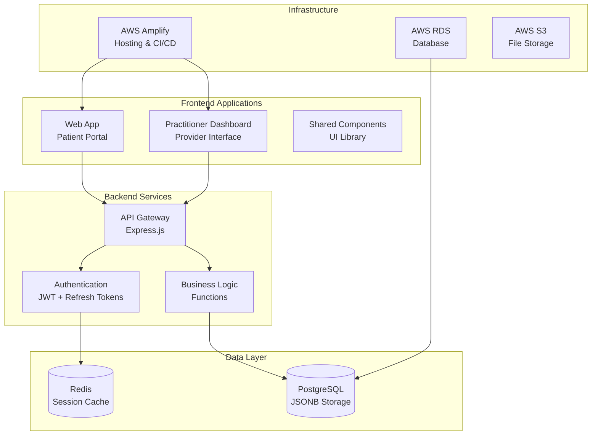
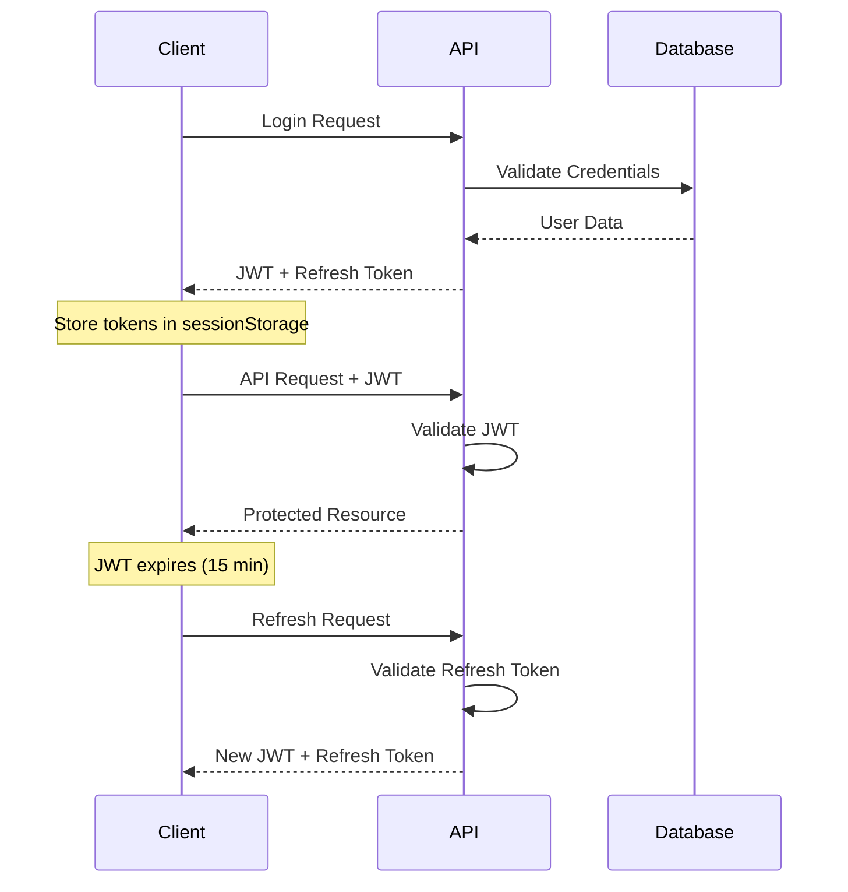

# Architecture Guide

## System Overview

The Health Platform is built as a modern, scalable web application with clear separation between frontend applications and backend services, utilizing JSONB for flexible data storage.

## High-Level Architecture



## Frontend Architecture

### Web App (Patient Portal)
- **Purpose**: Primary interface for patients to manage their health data
- **Technology**: React with modern hooks and context
- **Features**: 
  - Patient dashboard with timeline view
  - Daily reflection forms with JSONB storage
  - Protocol-based food guidance
  - Secure authentication with session storage

### Practitioner Dashboard
- **Purpose**: Healthcare provider interface for patient management
- **Technology**: React with role-based access control
- **Features**:
  - Patient management dashboard
  - Clinical notes and observations
  - Treatment planning tools
  - Analytics and reporting

### Shared Components
- **Purpose**: Reusable UI components and utilities
- **Technology**: Component library with modern React patterns
- **Contents**:
  - Design system components
  - Safe logging utility
  - Authentication providers
  - Common business logic

## Backend Architecture

### API Layer
- **Framework**: Express.js with comprehensive error handling
- **Authentication**: JWT with refresh token rotation
- **Security**: CORS, rate limiting, input validation, safe logging
- **Documentation**: OpenAPI/Swagger specification

### Business Logic
- **Organization**: Domain-driven design with clear service boundaries
- **Functions**: Modular functions for each business domain
- **Validation**: Comprehensive input/output validation
- **Error Handling**: Centralized error handling with secure logging

### Database Design
- **Primary Database**: PostgreSQL with JSONB for flexible data storage
- **Modern Schema**: JSONB-first approach for health data
- **Indexing**: GIN indexes for fast JSONB queries
- **Backup**: Automated backups with point-in-time recovery

## Security Architecture

### Authentication Flow


### Security Measures
- **Safe Logging**: Custom logging utility that sanitizes sensitive data
- **Session Storage**: Health data stored in browser sessions (cleared on close)
- **Token Sanitization**: JWT tokens never appear in console logs
- **Environment Awareness**: Minimal logging in production
- **Data Protection**: Automatic PII removal from logs

## Data Architecture

### JSONB-First Design

#### **journal_entries Table:**
```sql
CREATE TABLE journal_entries (
    id UUID PRIMARY KEY DEFAULT uuid_generate_v4(),
    user_id UUID REFERENCES users(id),
    entry_date DATE NOT NULL,
    reflection_data JSONB DEFAULT '{}',
    consent_to_anonymize BOOLEAN DEFAULT false,
    created_at TIMESTAMP DEFAULT now(),
    updated_at TIMESTAMP DEFAULT now()
);
```

#### **timeline_entries Table:**
```sql
CREATE TABLE timeline_entries (
    id UUID PRIMARY KEY DEFAULT uuid_generate_v4(),
    journal_entry_id UUID REFERENCES journal_entries(id),
    user_id UUID REFERENCES users(id),
    entry_time TIME NOT NULL,
    entry_type VARCHAR(50) NOT NULL,
    entry_date DATE NOT NULL DEFAULT CURRENT_DATE,
    structured_content JSONB,
    created_at TIMESTAMP DEFAULT now()
);
```

### JSONB Structure Examples

#### **Reflection Data (journal_entries.reflection_data):**
```json
{
  "sleep": {
    "bedtime": "22:30",
    "wake_time": "07:00",
    "sleep_quality": "good",
    "sleep_symptoms": ["back pain"]
  },
  "wellness": {
    "energy_level": 8,
    "mood_level": 7,
    "physical_comfort": 6
  },
  "activity": {
    "activity_level": "moderate"
  },
  "meditation": {
    "meditation_duration": 15,
    "meditation_practice": true
  },
  "cycle": {
    "cycle_day": "5",
    "ovulation": false
  },
  "notes": {
    "personal_reflection": "Feeling good today..."
  }
}
```

#### **Timeline Data (timeline_entries.structured_content):**
```json
{
  "type": "food",
  "foods": [{
    "name": "chicken",
    "food_id": "uuid",
    "category": "protein",
    "compliance_status": "included"
  }],
  "notes": "Grilled chicken breast"
}
```

## Performance Architecture

### Frontend Optimization
- **Request Deduplication**: Prevents duplicate API calls in React Strict Mode
- **Safe Logging**: Minimal performance impact with environment-aware logging
- **Code Splitting**: Lazy loading of routes and components
- **Caching**: Intelligent caching of protocol and preference data

### Backend Optimization
- **JSONB Queries**: Optimized with GIN indexes for fast searches
- **Connection Pooling**: Efficient database connection management
- **Structured Logging**: Minimal overhead with sanitized output
- **Error Handling**: Fast-fail with comprehensive error context

## Deployment Architecture

### AWS Infrastructure
- **Hosting**: AWS Amplify for frontend applications
- **Database**: AWS RDS PostgreSQL with JSONB support
- **Functions**: AWS Lambda for backend API
- **Storage**: AWS S3 for file uploads and backups
- **Monitoring**: CloudWatch with custom dashboards

### CI/CD Pipeline


## Technology Stack

### Frontend
- **Framework**: React 18+ with TypeScript
- **State Management**: Context API + useReducer
- **Styling**: Tailwind CSS with custom design system
- **Build Tool**: Vite for fast development and builds
- **Security**: Safe logging utility, session storage

### Backend
- **Runtime**: Node.js with Express.js
- **Language**: TypeScript for type safety
- **Database**: PostgreSQL with JSONB
- **Authentication**: JWT with secure refresh tokens
- **Logging**: Custom safe logging utility

### Infrastructure
- **Cloud Provider**: AWS
- **Hosting**: Amplify for frontend, Lambda for backend
- **Database**: RDS PostgreSQL with JSONB support
- **Storage**: S3 for files, CloudFront for CDN
- **Monitoring**: CloudWatch + custom dashboards

## Recent Improvements (July 2025)

### **Security Enhancements:**
- Implemented safe logging utility to prevent sensitive data exposure
- Eliminated JWT token visibility in console logs
- Added environment-aware logging levels

### **Performance Improvements:**
- Fixed duplicate API call issues
- Added request deduplication for React Strict Mode
- Optimized hook dependencies and cleanup

### **Database Migration:**
- Successfully migrated to JSONB-first architecture
- Improved query performance with GIN indexes
- Flexible schema for future health data types

---

**Last Updated**: July 15, 2025  
**Version**: 2.0 (Post-JSONB Migration)  
**Next Review**: August 15, 2025